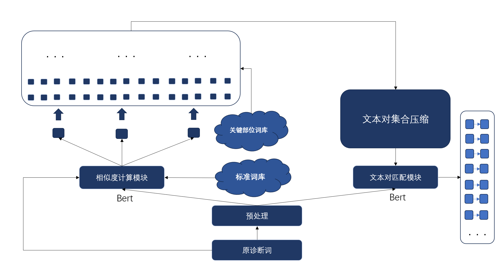

## DualStage-MedTermMapper：A BERT-based Multi-Model Collaborative Mapping Approach for Medical Term Standardization

双阶医学术语映射：基于BERT的多模型协同映射医学术语标准化方法

## 简介

本项目为广东省生物医学工程竞赛命题赛道数据类专门设计，提出了一种基于BERT的多模型协同映射方法来实现医学术语的标准化。我们的解决方案结合了相似度计算模型与文本对匹配模型的优点，旨在提供一种轻量化、低运算成本的双模型匹配机制。

This project is specially designed for the data class of the proposition track of the Guangdong Biomedical Engineering Competition, and a multi-model collaborative mapping method based on BERT is proposed to realize the standardization of medical terms. Our solution combines the advantages of the similarity calculation model and the text pair matching model, aiming to provide a lightweight and low computational cost dual-model matching mechanism.

我们的模型

## 特性

- **高效性**：通过优化的双模型架构，确保在保持高性能的同时降低运算成本。
- **可扩展性**：配置有可扩展的标准术语库和关键词检索术语库，支持未来进一步拓展。
- **准确性**：在赛事提供的测试集上展现了良好的性能表现。

## 预训练模型

MC-BERT is a novel conceptualized representation learning approach for the medical domain. First, we use a different mask generation procedure to mask spans of tokens, rather than only random ones. We also introduce two kinds of masking strategies, namely whole entity masking and whole span masking. Finally, MC-BERT split the input document into segments based on the actual "sentences" provided by the user as positive samples and sample random sentences from other documents as negative samples for the next sentence prediction.

## More detail:

https://github.com/alibaba-research/ChineseBLUE

https://huggingface.co/freedomking/mc-bert/tree/main

本工程代码提供是本地读取模型，可改为调用huggingface的模型

## prepare

environment.yml

## 结果
准确率: 0.8529
精确率: 0.7718
召回率: 0.7810
F1 分数: 0.7709
平均 BLEU 分数: 0.4151
平均 ROUGE-1 F1 分数: 0.8865
平均 ROUGE-2 F1 分数: 0.7846
平均 ROUGE-L F1 分数: 0.8863
预测结果已保存至 submission.csv

## 其他
代码已给大量注释说明
使用了sentence-bert分词

